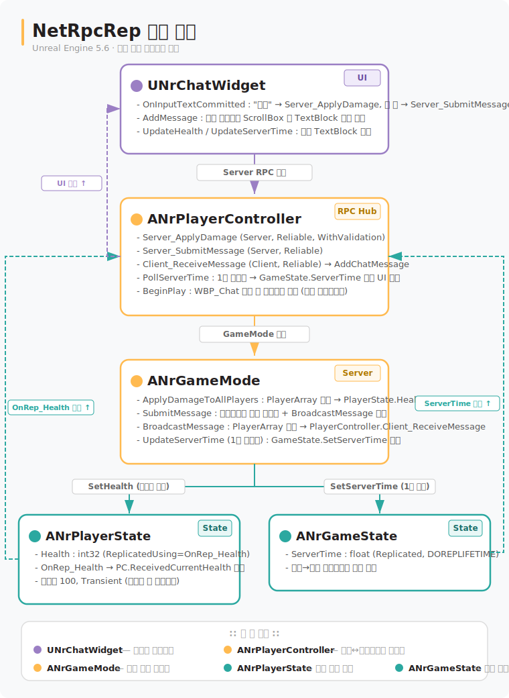

# NetRpcRep

Unreal Engine 5.6 C++ 멀티플레이어 네트워킹 학습 프로젝트.

**RPC(Remote Procedure Call)** 와 **변수 복제(Replication)** 의 동작 원리를 채팅 + 공격 시스템으로 직접 확인할 수 있습니다.

---

## 학습 목표

| 주제 | 내용 |
|---|---|
| Server RPC | 클라이언트 입력(메시지)을 서버에 전송 |
| Client RPC | 서버가 특정 클라이언트에게만 메시지를 전송 |
| Multicast RPC | 서버에서 모든 클라이언트에게 동시에 데이터를 전송 |
| ReplicatedUsing | 변수가 복제될 때 콜백(OnRep)으로 UI를 자동 갱신 |
| Replicated | `DOREPLIFETIME`으로 변수를 모든 클라이언트에 동기화 |

---

## 개발 환경

- **Unreal Engine** 5.6
- **Visual Studio** 2022
- **C++ 표준** C++20
- **모듈 의존성** Core, CoreUObject, Engine, InputCore, EnhancedInput, UMG, SlateCore

---

## 시작하기

1. `NetRpcRep.uproject` 우클릭 → **Generate Visual Studio project files**
2. `NetRpcRep.sln`을 Visual Studio 2022로 열기
3. 빌드 후 에디터에서 `/Game/Maps/L_Game` 실행
4. **PIE 멀티플레이어** (플레이어 수 2 이상) 로 실행하여 동작 확인

---

## 아키텍처

### 네트워크 흐름 (서버 권위 모델)



### 클래스 역할

| 클래스 | 위치 | 역할 |
|---|---|---|
| `ANrGameMode` | 서버 전용 | 데미지 적용, 메시지 라우팅 |
| `ANrGameState` | 서버→전체 복제 | ServerTime 동기화 |
| `ANrPlayerState` | 서버→소유 클라이언트 복제 | Health 관리 및 OnRep UI 갱신 |
| `ANrPlayerController` | 서버↔클라이언트 RPC 허브 | 입력 처리, UI 생성 |
| `UNrChatWidget` | 클라이언트 UI | 채팅 입출력, 체력·서버 시간 표시 |

---

## 주요 기능 시연

### 1. 채팅 메시지 전송

```
입력창에 텍스트 입력 후 Enter
  → Server_SubmitMessage (Server RPC)
  → GameMode.SubmitMessage
  → 발신자에게 "[시스템] 서버에 메시지 전달 성공" Client RPC
  → 다른 클라이언트 전체에 메시지 Client RPC
```

### 2. 공격

```
입력창에 "공격" 입력 후 Enter
  → Server_ApplyDamage(10) (Server RPC)
  → GameMode.ApplyDamageToAllPlayers
  → 공격자 제외 모든 PlayerState.Health -= 10 (Replicated)
  → OnRep_Health 콜백 → 각 클라이언트 UI 체력 갱신
  → "[시스템] 누군가 당신을 공격(-10) 합니다." 브로드캐스트
```

### 3. 서버 시간 동기화

```
GameMode 타이머 (1초 주기)
  → GameState.ServerTime 갱신 (Replicated)
  → PlayerController 타이머 (1초 주기) → UI ServerTimeTextBlock 갱신
```

---

## 파일 구조

```
Source/NetRpcRep/
├── GameFramework/
│   ├── NrGameMode.h / .cpp         # 서버 권위 처리
│   ├── NrGameState.h / .cpp        # 전체 복제 상태
│   ├── NrPlayerState.h / .cpp      # 개인 복제 상태 (Health)
│   └── NrPlayerController.h / .cpp # RPC 허브
└── UI/
    ├── NrChatWidget.h / .cpp       # 채팅 UMG 위젯
Content/
├── Maps/L_Game                     # 기본 게임 맵
└── UI/WBP_Chat                     # 채팅 위젯 블루프린트
```

---

## RPC 요약표

| 함수 | 종류 | 방향 | 용도 |
|---|---|---|---|
| `Server_ApplyDamage` | Server Reliable + Validate | Client → Server | 공격 요청 |
| `Server_SubmitMessage` | Server Reliable | Client → Server | 채팅 전송 |
| `Client_ReceiveMessage` | Client Reliable | Server → Client | 메시지 수신 |
